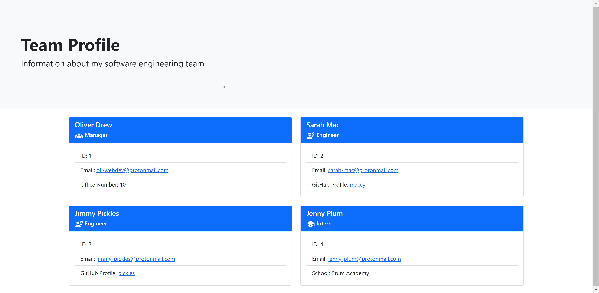

# Team Profile Generator

## Description

An application that creates a html webpage of a software development team's structure and employee information. The application uses NodeJS and the Inquirer package to prompt the user to answer a series of questions and then outputs a html file file based on the given answers. Enjoy!

---

## Table of Contents

1. [Installation](#installation)
2. [Usage](#usage)
3. [License](#license)
4. [Contributing](#contributing)
5. [Tests](#tests)
6. [Questions](#questions)

## Installation

- Git Clone this repository
- Navigate to the directory you cloned it to
- Enter `npm install`
- To start the program enter: `node index.js`
- Answer the questions!
- Your html team profile will be saved to the /dist directory

## Usage

To start the application please run `node index.js`

- Enter the team managers information
- At this point you can either create the team or add an Engineer or Intern to the team.
- If you choose to add another team member, you will be prompted for their information.
- After each team member you will be asked if you want to finalise the team or add another member.
- When you chose to create the team, the application creates the html file and finishes.

The HTML file created uses Bootstrap 5 to display the employee cards.

- Clicking on a team member's email address opens the default email application.
- Clicking on a Github username opens the profile in a new tab.

A video walkthrough of how to use this application is available here: https://drive.google.com/file/d/12Pv3ruq4Ej5le7NndxiH7AxPtDkzgzfP/view?usp=sharing

### Sample profile created by the application

## License

This project is licensed under MIT.

## Contributing

- Oliver Drew

## Tests

This application uses Jest for testing. There is a test suite for each employee class.
The tests can be run via the command: `npm test`

## Questions

If you have any questions please contact me via [GitHub](https://github.com/oli-drew) or [Email](mailto:oli-webdev@protonmail.com)
